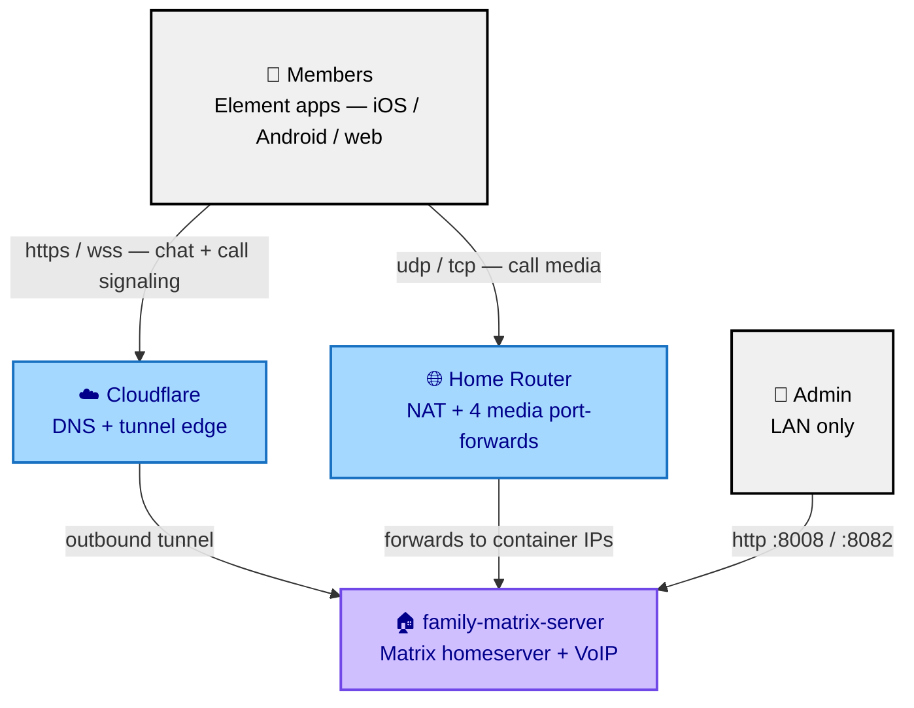
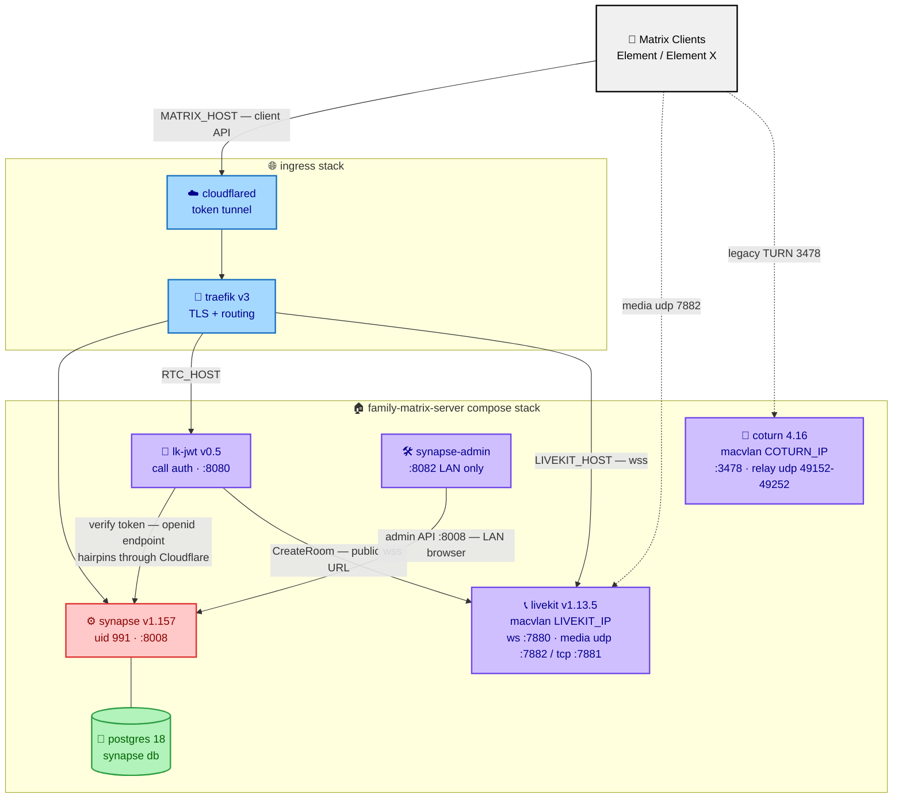

# Architecture

A private Matrix homeserver for a family or small group: encrypted chat,
group voice/video (Element Call). Designed as a
**closed system**: no federation, no public registration, no public admin
surface. Example values: `matrix.example.com`, LAN `192.168.1.0/24`, media
container IPs `192.168.1.241`/`.242`.

## System Context

Trust boundaries:

- **Internet → HTTP** only via the Cloudflare tunnel; the origin publishes no
  inbound HTTP ports. `/_synapse/*` (admin API) is additionally 403'd at
  Traefik on the public hostname.
- **Internet → media** is exactly four router forwards terminating on two
  dedicated container IPs — never the docker host.
- **Federation is off.** The single federation-namespace endpoint served is
  the unauthenticated `openid/userinfo`, required by call auth (Decision 5).

## Container Diagram

### Networks

| Network | Members | Purpose |
|---|---|---|
| stack-internal bridge | synapse, db, synapse-admin | internal service traffic |
| `TRAEFIK_NETWORK` (external) | synapse, lk-jwt, livekit | ingress from traefik/cloudflared |
| `lanvlan` (macvlan on `MACVLAN_PARENT`) | coturn, livekit | dedicated LAN IPs for media. **The docker host cannot reach these IPs** (kernel isolation) — test from another LAN device. livekit is dual-homed (macvlan for media + traefik network for signaling). |

coturn and livekit have **no compose port mappings** — they own their macvlan
IPs; ports live in `turnserver.conf`/`livekit.yaml` and router forwards point
at the macvlan IPs directly.

### Data

- `files/` — synapse config, signing key, media (uid 991). `schemas/` —
  postgres (uid 70).
- The `synapse` database is auto-created by postgres env vars.
- Secrets originate in `.env`; several are rendered as literals into configs
  (see OPERATIONS.md rotation notes).

## Key decisions

1. **Closed server** — no federation listener resource + empty
   `federation_domain_whitelist`; registration disabled; E2EE default.
   Consequence: members-only reachability, tiny attack surface; no
   cross-server chat (deliberate).
2. **Postgres backend** — synapse's recommended database; sqlite is not used.
3. **Admin plane is LAN-only** — no public admin hostname; `/_synapse` 403'd
   publicly via a higher-priority Traefik router with an unmatchable
   `ipAllowList`. Consequence: admin work requires LAN (or your own VPN).
4. **Media bypasses the tunnel; per-service LAN IPs via macvlan** — WebRTC
   UDP cannot traverse a Cloudflare tunnel, so media terminates on dedicated
   macvlan IPs with narrow forwards. LAN devices reach the SFU at L2
   (switch-speed, no NAT hairpin — LiveKit advertises its internal IP as an
   ICE candidate); a compromised media container is an isolated single-process
   host, not the docker box.
5. **The openid exception** — the call-auth service (lk-jwt) validates Matrix
   tokens via server discovery (`/.well-known/matrix/server` →
   `/_matrix/federation/v1/openid/userinfo`). Therefore
   `serve_server_wellknown: true` and the `openid` listener resource stay on
   despite the closed-federation posture. Removing either breaks all calls
   with "unable to create room on SFU". The verification request hairpins out
   through Cloudflare's edge and back — HTTPS only, by design.
6. **Single-port UDP mux for LiveKit** — one forwarded media port instead of
   the classic 50000–60000 range. Requires ≥16 MiB UDP socket buffers on the
   host (`host-fixes.sh`); below that LiveKit is silently capped and bursty
   multi-party calls drop packets server-side with no log warning.
7. **Token-based Cloudflare tunnel** in the bundled ingress — hostnames are
   managed in the dashboard. Locally-managed tunnels' `tunnel route dns`
   writes DNS records into whichever zone its cert belongs to, a wrong-zone
   trap on multi-domain accounts.
8. **Version pinning, manual updates** — internet-listening coturn/livekit
   are the priority update targets; no blind auto-updates on stateful
   services (synapse runs schema migrations on upgrade).
9. **Conditional AppArmor patch** — some newer kernel/AppArmor-4.1 combos
   (notably Proxmox) deny af_unix sockets in all containers, crashing
   postgres and nginx. `host-fixes.sh` tests for the regression and installs
   an `abi <abi/3.0>,`-pinned docker-default profile only when affected.
